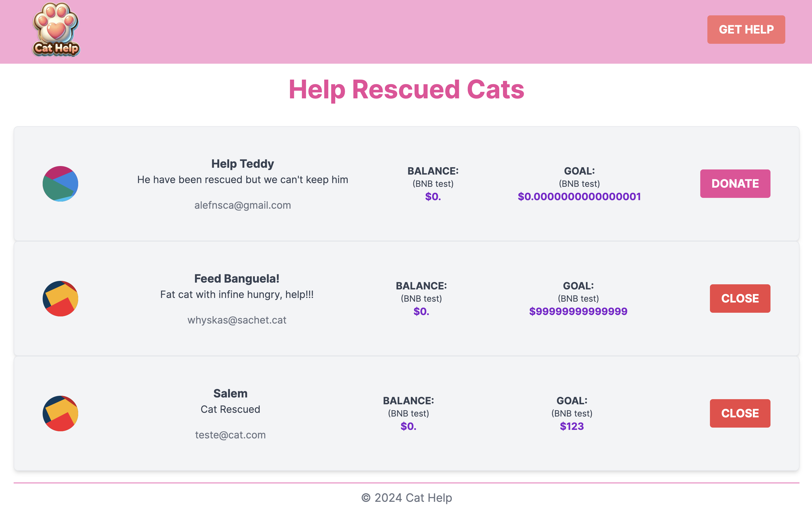

# CatHelp Documentation

[Live Demo](https://cat-help.vercel.app/)

## Specs

|     | Specs                                                                                                                |
| --- | -------------------------------------------------------------------------------------------------------------------- |
| ✨  | **Next.js** The most fresh technology to frontend built with React.                                             |
| 🔓  | **Web3.js** Handy Dandy library for Blockchain operations.                    |
| 🧙🏼‍♀️  | **TypeScript** typed programming language that builds on JavaScript.                                                                                          |
| 🌬️   | **Tailwind** A utility-first CSS framework for building fast and powerful interfaces.|

## Features

|     | Features                                                                                                             |
| --- | -------------------------------------------------------------------------------------------------------------------- |
| ✅  | Metamask user login                                     |
| ✅  | List of Help Requests                                                    |
| ✅  | Open Requests, Donate to an Existent Request, Close Request                                           |

## Contact

- **Maintainer:** Alexandre Fonseca
- **Email:** alexandrefonsecach@gmail.com
